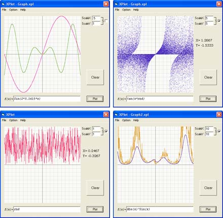



## XPlot

### Description

XPlot is a general purpose graph plotter with manny options to cusomize.(see screenshots)

I would really like some comments on how to improve and suggestions on new features that can be added.
 
### More Info
 

             |
---                |---
**Submitted On**   |2002-03-02 00:39:58
**By**             |[Asim Aziz](https://github.com/Planet-Source-Code/PSCIndex/blob/master/ByAuthor/asim-aziz.md)
**Level**          |Intermediate
**User Rating**    |5.0 (110 globes from 22 users)
**Compatibility**  |VB 6\.0
**Category**       |[Math/ Dates](https://github.com/Planet-Source-Code/PSCIndex/blob/master/ByCategory/math-dates__1-37.md)
**World**          |[Visual Basic](https://github.com/Planet-Source-Code/PSCIndex/blob/master/ByWorld/visual-basic.md)
**Archive File**   |[XPlot58624312002\.zip](https://github.com/Planet-Source-Code/asim-aziz-xplot__1-32232/archive/master.zip)

